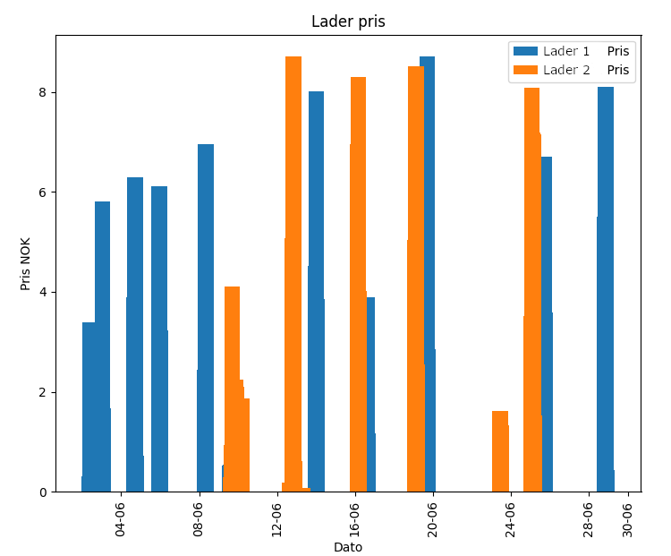

# easeepris
Rapporterer pris på lading via easee lader for en oppgitt måned for en valgt prisregion.

Kombinerer time for time data i fra Strømpris API med forbruks data i fra Easee API.
Perioden er alltid hele foregående måned.
Sett ditt Easee brukernavn og passord i env vars ```API_USER``` og ```API_PASSWORD``` 

Programmet finner alle ladere assosiert med din konto og rapporterer forbruk per lader samt total.

## Start

    usage: forbruk.py [-h] -r REGION -m MONTH -y YEAR [-c CSV] [-t {a,n}] [-p]

    optional arguments:
      -h, --help            show this help message and exit
      -r REGION, --region REGION
                            Pris region, f.eks. NO2
      -m MONTH, --month MONTH
                            Måned nr., feks 11
      -y YEAR, --year YEAR  Årstall
      -c CSV, --csv CSV     CSV filename
      -t {a,n}, --type {a,n}
                            Append eller Ny fil
      -p, --plot            Plot en rapport

## Disclaimer
NB! Ikke verifisert korrekt! Resultatene kan være feil...og priser i fra din leverandør/avtale kan være forskjellige.

## Eksempel output:

      python3 forbruk.py --region NO2 -m 5 -y 2023
      Rapport start:  2023-05-01
      Rapport slutt:  2023-05-31
      Logged on to Easee API!
      Pris for lader EH-----9 Lader1        76.86 NOK
      Pris for lader EH-----4 Lader2        96.54 NOK
      Totalpris for perioden: 173.4 NOK
## Plot

Hvis -p brukes lages en enkel graf over pris på forbruket.

NB! Pris vises per time. I eksempelet nedenfor er hver søyle flere timer.


