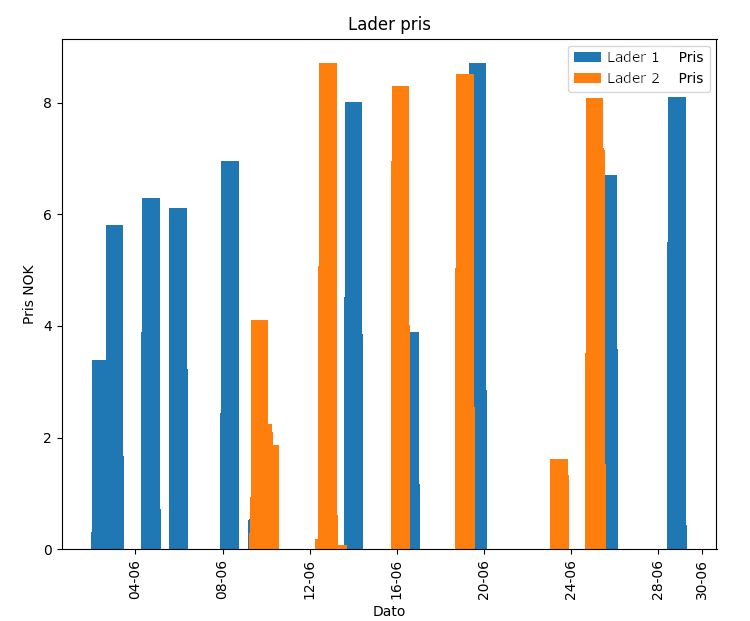

# easeepris
Rapporterer pris på lading via Easee lader for en oppgitt måned for en valgt prisregion.

Kombinerer time-for-time data fra [Hva koster strømmen? API](https://www.hvakosterstrommen.no/strompris-api) med forbruksdata fra Easee API.

## Oppsett

1. **Opprett virtuell omgivelse:**
   ```powershell
   python -m venv .venv
   .\.venv\Scripts\activate
   pip install -r requirements.txt
   ```

2. **Konfigurer legitimasjon:**
   Kopier `.env.example` til `.env` og legg inn ditt Easee brukernavn og passord:
   ```env
   API_USER=ditt_brukernavn
   API_PASSWORD=ditt_passord
   ```

## Bruk

Programmet finner alle ladere assosiert med din konto og rapporterer forbruk per lader samt total.

```powershell
python forbruk.py -r REGION -m MONTH -y YEAR [-c CSV] [-t {a,n}] [-p]
```

### Argumenter:
- `-h, --help`: Vis hjelp-melding.
- `-r, --region REGION`: Prisregion (f.eks. `NO1`, `NO2`, `NO3`, `NO5`).
- `-m, --month MONTH`: Månedens nummer (f.eks. `11`).
- `-y, --year YEAR`: Årstall (f.eks. `2024`).
- `-c, --csv CSV`: Filnavn for CSV-eksport.
- `-t, --type {a,n}`: Bruk `a` for append (legg til) eller `n` for ny fil (overskriv).
- `-p, --plot`: Vis en grafisk rapport over forbruket.

### Eksempel:
```powershell
python forbruk.py --region NO2 -m 4 -y 2026 -p
```

## Disclaimer
NB! Resultatene er ikke verifisert for nøyaktighet. Faktiske priser fra din strømleverandør kan variere avhengig av din spesifikke avtale.

## Plot
Hvis `-p` brukes, vises en graf over kostnad for forbruk per time.


